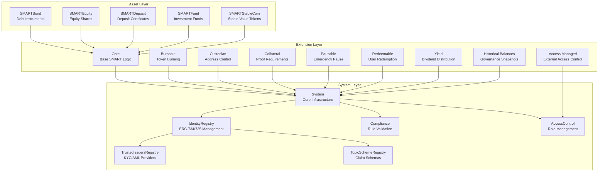
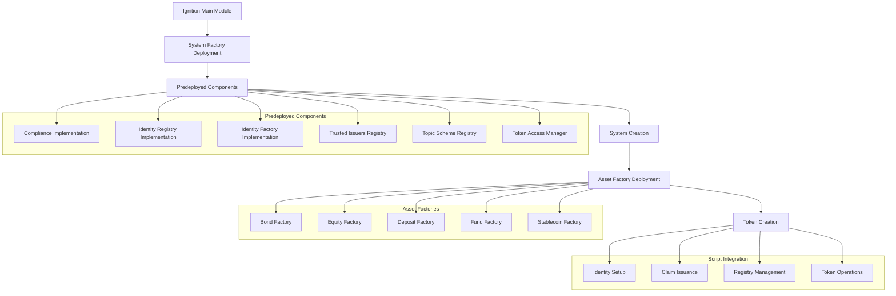

# SMART Protocol Contracts

This directory contains the complete SMART Protocol smart contract implementation, providing a three-layer architecture for regulatory-compliant tokenization on EVM-compatible blockchains.

## Architecture Overview



## Contract Directory Structure

### `/assets/` - Asset Token Implementations

Contains the five core asset types with their interfaces, implementations, and factory contracts:

- **Bond** (`/bond/`): Fixed-income debt instruments with yield distribution and redemption
- **Deposit** (`/deposit/`): Deposit certificates with collateral backing requirements
- **Equity** (`/equity/`): Equity shares with voting rights and dividend capabilities
- **Fund** (`/fund/`): Investment fund shares with management fee structures
- **Stable Coin** (`/stable-coin/`): Regulatory-compliant stable value tokens

Each asset type follows the proxy pattern:

- `I[Asset].sol` - Interface definition
- `[Asset]Implementation.sol` - Logic contract
- `[Asset]Proxy.sol` - Upgradeable proxy
- `[Asset]FactoryImplementation.sol` - Factory for creating new instances

### `/extensions/` - Modular Functionality

Extensible features that can be mixed into any asset token:

#### Core Extensions

- **`/core/`**: Base SMART logic with compliance and identity verification
- **`/common/`**: Shared utilities, contexts, and base contracts

#### Feature Extensions

- **`/burnable/`**: Token burning for both owner and self-burn scenarios
- **`/custodian/`**: Address freezing, partial freezing, and forced transfers
- **`/collateral/`**: Proof-of-collateral requirements for large transfers
- **`/pausable/`**: Emergency pause functionality with role-based control
- **`/redeemable/`**: User-initiated token redemption (distinct from burning)
- **`/yield/`**: Dividend/yield distribution with configurable schedules
- **`/historical-balances/`**: Snapshot functionality for governance voting
- **`/access-managed/`**: Integration with external access control systems
- **`/capped/`**: Supply cap enforcement

Each extension follows the pattern:

- `I[Extension].sol` - Interface
- `[Extension].sol` - Standard implementation
- `[Extension]Upgradeable.sol` - Upgradeable implementation
- `internal/_[Extension]Logic.sol` - Core logic library

### `/system/` - Infrastructure Layer

ERC-3643 compliant infrastructure for identity and compliance:

- **`SMARTSystem.sol`**: Central system coordinator
- **`SMARTSystemFactory.sol`**: Factory for deploying new system instances
- **`/identity-registry/`**: ERC-734/735 identity management
- **`/compliance/`**: Modular compliance rule engine
- **`/access-manager/`**: Role-based access control (ERC-5313)
- **`/trusted-issuers-registry/`**: KYC/AML claim issuer management
- **`/topic-scheme-registry/`**: Claim topic schema definitions
- **`/identity-factory/`**: Factory for creating on-chain identities
- **`/token-factory/`**: Abstract base for asset-specific factories

### `/interface/` - Contract Interfaces

- **`/ERC-3643/`**: Standard ERC-3643 interfaces
- **`ISMART.sol`**: Core SMART token interface
- **`/structs/`**: Shared data structures

### `/vendor/` - Third-party Dependencies

External contract dependencies and modified versions.

## Deployment Architecture

The deployment process follows a structured approach using Hardhat Ignition:



### Ignition Modules (`/ignition/modules/`)

#### Main Deployment (`main.ts`)

- Orchestrates full protocol deployment
- Deploys SystemFactory with all implementation contracts
- Sets up asset factories for all five asset types

#### Onboarding Setup (`onboarding.ts`)

- Creates a complete working system instance
- Bootstraps identity and compliance infrastructure
- Deploys asset factories ready for token creation

#### Predeployed Components (`/predeployed/`)

- Individual modules for each system component
- Implementation contracts that can be upgraded
- Configured for immediate use in new systems

#### Onboarding Assets (`/onboarding/assets/`)

- Asset-specific factory deployments
- Connected to the onboarded system instance
- Ready for immediate token creation

### Script Integration (`/scripts/hardhat/`)

The scripts folder provides runtime interaction with deployed contracts:

#### Main Orchestration (`main.ts`)

1. **System Setup**: Deploys and configures complete protocol
2. **Actor Initialization**: Sets up owner, claim issuer, and investors
3. **Topic Registration**: Configures claim schemas (KYC, AML, etc.)
4. **Trust Setup**: Adds authorized claim issuers
5. **Identity Management**: Registers and verifies user identities
6. **Asset Creation**: Demonstrates all five asset types

#### Actor Management (`/actors/`)

- **Owner**: Protocol administrator with governance rights
- **Claim Issuer**: KYC/AML verification provider
- **Investors**: End users with verified identities

#### Asset Deployment (`/assets/`)

- Asset-specific creation scripts
- Demonstrates configuration options
- Shows integration with compliance and identity systems

#### Utility Functions (`/utils/`)

- Contract interaction helpers
- Event monitoring and parsing
- Cross-chain compatibility utilities

## Key Design Patterns

### Proxy Pattern (ERC-1822 UUPS)

All system contracts use upgradeable proxies:

- Logic contracts in `*Implementation.sol`
- Proxy contracts in `*Proxy.sol`
- Factory-based deployment for new instances

### Extension System

Tokens inherit functionality through multiple inheritance:

```solidity
contract MyToken is
    SMART,              // Core functionality
    SMARTBurnable,      // Burning capability
    SMARTYield,         // Dividend distribution
    SMARTAccessManaged  // External access control
{
    // Token-specific logic
}
```

### Identity & Compliance Integration

- All transfers check `isVerified()` via identity registry
- Compliance modules validate transfers based on custom rules
- Claim topics configurable per token (KYC, accredited investor, etc.)

### Meta-Transaction Support (ERC-2771)

- All contracts support gasless transactions via trusted forwarders
- Use `_msgSender()` instead of `msg.sender` throughout

## Development Workflow

### 1. Contract Development

```bash
# Compile contracts
npm run compile:forge

# Run tests
npm run test

# Check coverage
npm run coverage
```

### 2. Deployment

```bash
# Deploy to local network with full setup
npm run deploy:local:onboarding

# Deploy for testing (minimal setup)
npm run deploy:local:test

# Deploy to remote network
npm run deploy:remote
```

### 3. Integration Testing

```bash
# Run the main script (full protocol demonstration)
npx hardhat run scripts/hardhat/main.ts --network localhost
```

## Security Considerations

### Access Control

- Role-based permissions using ERC-5313
- Multi-signature requirements for critical operations
- Emergency pause functionality with time locks

### Compliance Integration

- Automated KYC/AML verification
- Jurisdiction-specific rule enforcement
- Audit trail for all compliance decisions

### Upgrade Safety

- UUPS proxy pattern with admin controls
- Implementation upgrade requires governance approval
- Storage layout compatibility verification

## Integration Points

### With Subgraph (`/subgraph/`)

- Events indexed for off-chain querying
- Real-time compliance monitoring
- Historical data analysis

### With Frontend Applications

- StandardContract ABIs generated automatically
- Event monitoring for UI updates
- Meta-transaction support for gasless UX

### With External Systems

- ERC-3643 standard compliance
- Integration with traditional KYC providers
- Cross-chain bridge compatibility

This architecture provides a complete regulatory-compliant tokenization platform while maintaining flexibility for custom requirements and future extensions.
