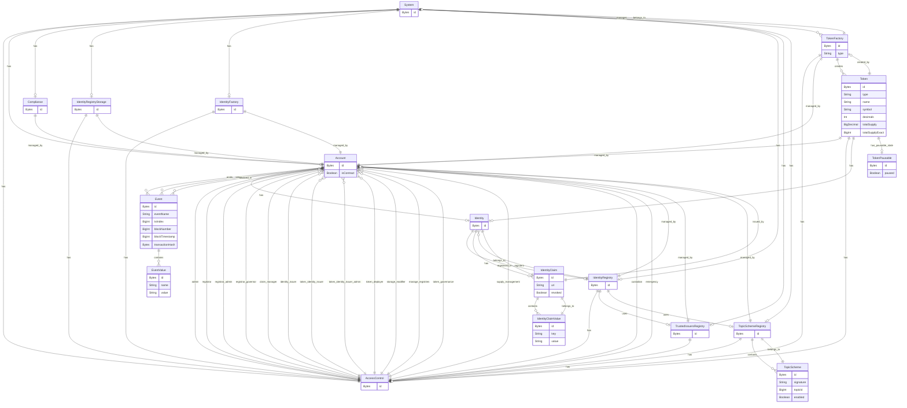

# SMART Protocol Subgraph

This subgraph indexes events and entities from the SMART Protocol smart contracts, providing a GraphQL API for querying tokenization data, identity management, compliance, and access control information.

## Entity Relationships

The following diagram shows the relationships between all entities in the SMART Protocol subgraph:

## Key Entity Types

### Core System Entities

- **System**: Central system entity that manages all protocol components
- **AccessControl**: Role-based access control for different system functions
- **Account**: Represents Ethereum addresses (both contracts and EOAs)

### Identity & Compliance

- **Identity**: On-chain identities for wallets and tokens (ERC-734/735)
- **IdentityRegistry**: Manages registered identities and their validation
- **IdentityClaim**: Claims associated with identities (KYC, accreditation, etc.)
- **IdentityClaimValue**: Structured data within claims
- **TrustedIssuersRegistry**: Registry of authorized claim issuers
- **Compliance**: Compliance validation engine

### Token Infrastructure

- **TokenFactory**: Factory contracts for creating new tokens
- **Token**: Asset tokens (bonds, equity, deposits, funds, stablecoins)
- **TokenPausable**: Pausable state for tokens

### Topic & Scheme Management

- **TopicSchemeRegistry**: Registry for claim topic schemas
- **TopicScheme**: Individual topic schema definitions

### Event Tracking

- **Event**: All blockchain events with metadata
- **EventValue**: Structured event parameter data

## Usage

The subgraph provides a GraphQL endpoint for querying all protocol data. Common query patterns include:

- Fetching all tokens created by a specific factory
- Finding identities registered in a particular registry
- Tracking compliance events and access control changes
- Analyzing token transfers and supply changes
- Monitoring claim issuance and revocation

## Indexing Flow

The following flowchart shows how events flow through the subgraph's event handlers and create/update entities:

```mermaid
flowchart TD
    A[SystemFactory Contract] -->|SMARTSystemCreated event| B[handleSMARTSystemCreated]
    B --> C[fetchSystem]
    C --> D[System Entity Created]
    D --> E[AccessControl Template Started]

    F[System Contract] -->|Bootstrapped event| G[handleBootstrapped]
    G --> H[fetchCompliance]
    G --> I[fetchIdentityRegistry]
    G --> J[fetchIdentityRegistryStorage]
    G --> K[fetchTrustedIssuersRegistry]
    G --> L[fetchIdentityFactory]
    G --> M[fetchTopicSchemeRegistry]

    H --> N[Compliance Entity]
    I --> O[IdentityRegistry Entity]
    J --> P[IdentityRegistryStorage Entity]
    K --> Q[TrustedIssuersRegistry Entity]
    L --> R[IdentityFactory Entity]
    M --> S[TopicSchemeRegistry Entity]

    O --> T[IdentityRegistry Template Started]
    S --> U[TopicSchemeRegistry Template Started]

    F -->|TokenFactoryCreated event| V[handleTokenFactoryCreated]
    V --> W[fetchTokenFactory]
    W --> X[TokenFactory Entity]
    X --> Y[Token Template Started]

    Z[IdentityRegistry Contract] -->|IdentityRegistered event| AA[handleIdentityRegistered]
    AA --> BB[fetchIdentity]
    BB --> CC[Identity Entity]
    CC --> DD[Identity Template Started]

    Z -->|IdentityRemoved event| EE[handleIdentityRemoved]
    EE --> FF[Update Identity Entity]

    Z -->|TrustedIssuersRegistrySet event| GG[handleTrustedIssuersRegistrySet]
    GG --> HH[Update IdentityRegistry Entity]

    II[Identity Contract] -->|ClaimAdded event| JJ[handleClaimAdded]
    JJ --> KK[fetchIdentityClaim]
    KK --> LL[IdentityClaim Entity]
    LL --> MM[decodeClaimValues]
    MM --> NN[IdentityClaimValue Entities]

    II -->|ClaimRemoved event| OO[handleClaimRemoved]
    OO --> PP[Update IdentityClaim Entity as revoked]

    QQ[Token Contract] -->|Transfer event| RR[handleTransferCompleted]
    RR --> SS[Update Token Supply]

    QQ -->|Mint event| TT[handleMintCompleted]
    TT --> UU[Update Token Supply]

    VV[TopicSchemeRegistry Contract] -->|TopicSchemeRegistered event| WW[handleTopicSchemeRegistered]
    WW --> XX[fetchTopicScheme]
    XX --> YY[TopicScheme Entity]

    ZZ[AccessControl Contract] -->|RoleGranted event| AAA[handleRoleGranted]
    AAA --> BBB[Update AccessControl Entity]

    ZZ -->|RoleRevoked event| CCC[handleRoleRevoked]
    CCC --> DDD[Update AccessControl Entity]

    subgraph "Cross-cutting Concerns"
        EEE[All Event Handlers] --> FFF[fetchEvent]
        FFF --> GGG[Event Entity]
        GGG --> HHH[EventValue Entities]

        III[All Fetch Functions] --> JJJ[fetchAccount]
        JJJ --> KKK[Account Entity]
    end

    style A fill:#e1f5fe
    style F fill:#e8f5e8
    style Z fill:#fff3e0
    style II fill:#f3e5f5
    style QQ fill:#fce4ec
    style VV fill:#e0f2f1
    style ZZ fill:#fff8e1
```

## Development

The subgraph is built using The Graph Protocol and indexes events from SMART Protocol smart contracts deployed on the SettleMint network.

### Indexing Architecture

1. **Data Sources**: The main entry point is the SystemFactory contract which deploys new System instances
2. **Templates**: Dynamic contract indexing is enabled through templates for System, IdentityRegistry, Identity, Token, and other components
3. **Event Processing**: Each event handler follows a pattern of fetching/creating entities and updating relationships
4. **Cross-cutting Concerns**:
   - All events are tracked in the Event entity for audit trails
   - Account entities are created for all Ethereum addresses
   - AccessControl changes are tracked across all system components
